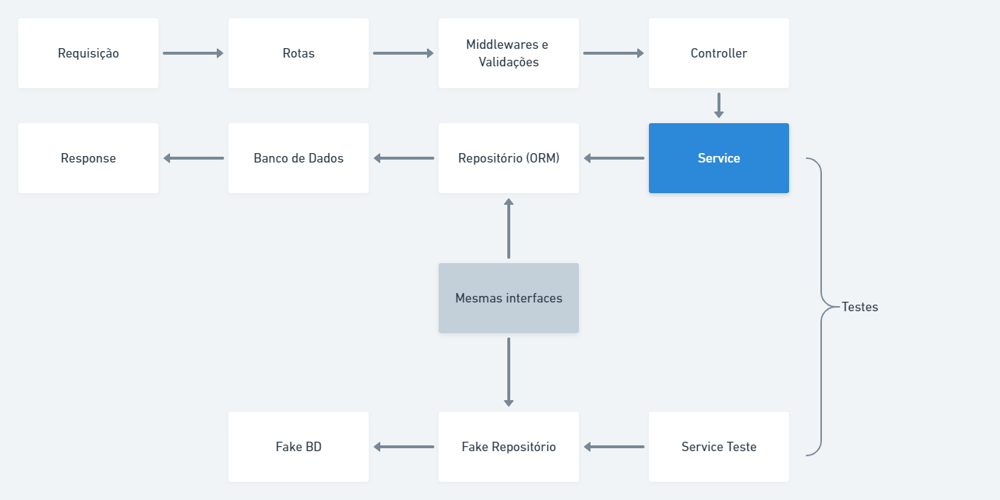

# VUTTR API

## Documentação API:


## Ferramentas
* Express
* MariaDB
* Typescript
* TypeORM
* Teste unitários com JEST
* CI/CD Pipeline com Github Actions
* Deploy na Digital Ocean

# Introdução
Essa API foi criada para cumprir os requisitos mínimos e alguns requisitos extras do desafio de backend da BossaBox

# Estrutura da API
A API segue a lógica da imagem abaixo:


Abaixo será descrita a estrutura de pastas do código da API

Todo o código da API se encontra na pasta `./src`:
## @types
Tipagens adicionais, como por exemplo, foi incluído um objeto user com a propriedade id no objeto de request do express para ser utilizado no middleware de autenticação;
## config
Arquivos auxiliares de configuração como configuração de base de dados, token JWT, e etc.
## modules
Os módulos da API, seguindo o conceito de DDD (Domain Driven Design), foram criados 2 módulos: user e tool.

Abaixo explico como foi dividida a estrutura dentro de cada módulo:

### Entities
São as entidades, ou seja, são as classes que definem como os dados serão trabalhados dentro do módulo e como as tabelas do banco de dados serão criadas.
### Routes
Contém as rotas pertinentes ao módulo, cada rota contém sua URI própria, middlewares de validação de dados e autenticação e método a ser executado no Controller.

### Controllers
São as classes chamadas pelas rotas. Como boa prática um Controller deve possuir no máximo 5 métodos:
* store: Criação de entidades
* update: Atualização de entidades
* destroy: Remoção de entidades
* show: Pesquisar uma entidade singular
* index: Pesquisar mais de uma entidade

**Cada um desses métodos deve utilizar como parâmetros `request`, `response` e retornar uma `Promise<response>`**

Dentro dos controllers não ocorrem validações, apenas o recebimento e preparação de dados do request para realizar a execução dos `Services` e retorno do `response`.

O retorno é feito dentro da classe BaseController (extendida por todos Controllers) para que caso seja necessário futuramente interceptar o retorno antes de retornar ao cliente, seja possível fazer em um lugar só

### Services
São as classes principais da API, são neles que as regras de negócio da API são validadas. Um `Service` deve possuir apenas um método público chamado `execute`, ou seja, um `Service` só pode possuir uma responsabilidade, de executar o serviço pelo qual foi criado.

O construtor de um `Service` deve receber as dependências que serão utilizadas dentro dele como por exemplo os repositórios de entidades que irá utilizar para realizar o seu serviço, além de provedores de outros serviços específicos como um provedor de hashs para criptografia de senhas, etc.

As dependências de um `Service` são injetadas no mesmo utilizando a lib `tsyringe` fazendo com que fique muito simples mudar a dependência que ele utiliza e realizar testes unitários.

É importante que a interface de dados que o método `execute` seja criada e armazenada em seu arquivo próprio dentro de `/src/modules/**/dto/`. Exemplo: `/src/modules/user/dto/ICreateUserDTO.ts` -> Essa interface é a utilizada pelo service de criação de usuários

### Rotas
As requisições dos clientes são recebidas aqui, todas as rotas dos módulos são importadas no arquivo `./src/shared/routes/index.ts`

### Testes
Dentro da pasta services de cada módulo há uma pasta contendo os arquivos de teste. Cada Service possui um arquivo de teste respectivo, sugiro sempre que for criar um novo service, iniciar criando-o e criar o teste respectivo antes de criar o Controller, rotas e etc.

Seguindo os conceitos de TDD (Test Driven Development), siga o passo-a-passo:
- Crie a entidade do novo módulo (se necessário) na pasta `<modulo>/entities`.
- Crie as interfaces que o service irá usar na pasta `<modulo>/dto`.
- Crie o Service na pasta `<modulo>/service`.
- Crie a interface que o repositório e o fakeRepositório irão utilizar na pasta `<modulo>/repositories/dto`.
- Crie o repositório na pasta `<modulo>/repositories/typeorm` e registre-o como dependência no arquivo `/src/shared/container/index.ts` (se necessário).
- Crie o fakeRepositório (se necessário) na pasta `<modulo>/repositories/fakes`.
- Crie o arquivo de testes e acompanhe pelo relatório de coverage quais trechos do service não foram testados ainda. (`coverage/lcov-report/index.html`, execute esse arquivo com a extensão do vscode `Live Server`)
- Sempre que criar um teste novo, faça-o falhar para verificar se realmente está testando o que é necessário.
- Quando o coverage do service atingir 100% no relatório, pode continuar com a criação do Controller, Rotas, Validação de rotas e etc.

Para rodar todos os testes basta rodar o comando `yarn test`. O relatório dos testes será gerado em `./coverage/lcov-report/index.html`.

### Repositories
São abstrações do banco de dados, nessa API foi utilizado o typeORM para criar essas abstrações, mas pode ser feito com outro ORM tranquilamente.

Além do repositório do banco de dados, também são criados repositórios idênticos chamados de fakes. Esses fakeRepositories são utilizados como mock nos testes unitários dos `Services` e **devem** implementar as mesmas interfaces que o repositório do BD implementa. Essas interfaces estão localizadas dentro de `./src/modules/**/repositories/dto/I<modulo>Repositoriy`

## shared
Contém arquivos que são compartilhados entre módulos

### container
Aqui é onde as dependências que serão injetadas nos `Services` estão sendo definidas, note que nem todas as dependências estão nesse arquivo, pois algumas estão registradas na pasta providers e apenas é importado o arquivo index.ts de providers, dessa forma fica mais organizado.

O arquivo `index.ts` da pasta container deve ser importado no topo do arquivo `server.ts` que é o arquivo rodado inicialmente ao subir o server.

### errors
Arquivos contendo as `Exceptions`, note que não há um try-catch nos `controllers`, portanto, os `throws` que são feitos dentro dos `Services` são pegos pelo `middleware` de erros localizado dentro dessa pasta e importado dentro de `server.ts`.

Dentro dessa pasta também está um `ENUM` de códigos HTTP que pode ser útil.

Sempre que criar uma nova `Exception` que receber um `statusCode`, tipar esse code com o type `HTTPStatusType` exportado dentro do arquivo `HTTPStatusEnum.ts`, vide exemplo das outras `Exceptions`.

### providers
São implementações de dependências externas, essas implementações devem respeitar uma interface definida dentro da pasta do provider, essa interface deve ser implementada também no provider Fake para que seja possível utilizá-lo nos testes unitários e manter os testes sem dependências externas.

### typeorm/migrations
Local onde os arquivos de migrations são armazenados, comandos úteis:
* Criar nova migration: `yarn typeorm migration:create -n <nomeDaMigration>`
* Rodar as migrations pendentes: `yarn mig:run` (irá realizar o build previamente)
* Reverter a última migration: `yarn mig:revert` (irá realizar o build previamente)

**OBS:** O build é rodado antes dos comandos `mig:run e mig:revert` para facilitar o processo de deploy, pois dessa forma as migrations são transpiladas e rodadas como arquivos `.js`

### utils
Algumas funções úteis para serem utilizadas e reaproveitadas entre diferentes módulos.

## Instruções para rodar

### Crie um repositório a partir desse template
Após criar o repositório rode `yarn` para instalar todas as dependências.
**É necessário ter o node instalado, tenha a última versão LTS**
### Criando BD no Docker


```bash
# Criação do conteiner
docker run --name mariadb -e MYSQL_ROOT_PASSWORD=<root-pass> -p 1234:3306 --restart always -d mariadb
# A tag "--restart always" reinicia o container automaticamente caso ele cair.

# Acessar o conteiner
docker exec -it mariadb /bin/bash

# Atualizar os pacotes
apt-get update

# Instalar o sudo
apt-get install sudo

# Acessar o banco com o usuário root
sudo mysql -u root -p

# Criar o banco de dados
CREATE DATABASE <database>;

# Criar o usuário que será utilizado pela aplicação (nunca utilizar o usuário root)
CREATE USER <user>@localhost IDENTIFIED BY '<senha>';

# Aplicando as permissões para o usuário criado no branco de dados
GRANT ALL PRIVILEGES ON <database>.* TO <user>@localhost IDENTIFIED BY '<senha>';
FLUSH PRIVILEGES;


Para iniciar o container: docker run mariadb
```

Após criar a base de dados e iniciá-la, crie o arquivo `.env` a partir do arquivo `.env.example` e preencha os dados referente ao banco de dados. Exemplo:
```
# Banco de dados
TYPEORM_CONNECTION=mariadb
TYPEORM_HOST=localhost
TYPEORM_PORT=1234
TYPEORM_USERNAME=root
TYPEORM_PASSWORD=root
TYPEORM_DATABASE=my_db

# TypeORM
TYPEORM_ENTITIES=./dist/modules/**/entities/typeorm/*.js
TYPEORM_MIGRATIONS=./dist/shared/typeorm/migrations/*.js
TYPEORM_MIGRATIONS_DIR=./src/shared/typeorm/migrations

# Porta da API
PORT=3333

# Ambiente
NODE_ENV=dev

# Segredo JWT
SEGREDO=segredo

```

### Rode a API
Agora que o BD está criado e as dependências instaladas, rode `yarn dev:server` para rodar a API, o console irá mostrar essa mensagem:

```
✅ - back-end rodando! na porta 3333
✅ - Conectado ao DB
```
